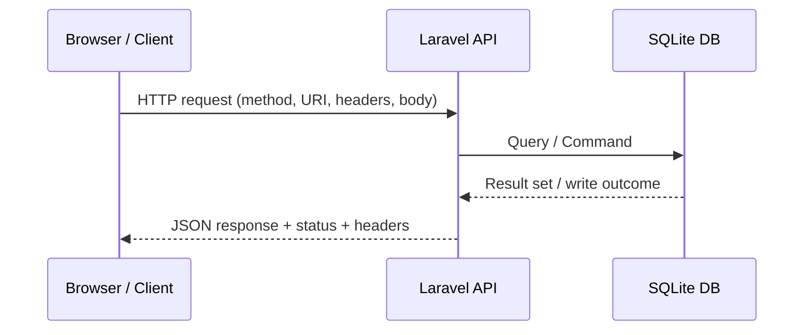

# 🎞️ SaaS‑2‑BED – Session 01

### _Introduction & REST API Foundations (Laravel 12)_

---


# **Welcome & Energiser**

### _Three‑word intros + “Great API” share_

<!-- Presenter Notes: Set tone, connect cohort, and surface examples of good APIs. Housekeeping: LMS access, repo hygiene, Laragon services check. Purpose: anchor later principles in prior experiences. -->

---


# **Unit Overview**

### _Assessments, tools, expectations_

<!-- Presenter Notes: Assessments: Portfolio + KBA (Session 03). Tools: Laragon, Laravel 12, Postman, Git Bash, SQLite. Emphasize professional workflow and commit discipline. -->

---


# **Mental Set: Request Journey**

### Browser → API → DB → Response



<!-- Presenter Notes: Clarify roles and stateless interactions; highlight how headers (Accept/Content-Type) direct behavior. -->

---


# **Session Objectives**

- Explain REST constraints & HTTP semantics
- Map verbs → status codes properly
- Scaffold Laravel 12 API (routes, controllers, resources)
- Verify with Postman; write a Pest test

<!-- Presenter Notes: Objectives frame the lesson and the success criteria you’ll assess informally at the end. -->

---


# **REST: What & Why**

### Architectural style, not a protocol

- Resources (nouns), representations (JSON), stateless
- Uniform interface, cacheability, layered system

<!-- Presenter Notes: REST ≠ “returns JSON”. Focus on constraints to avoid inconsistent designs and reduce client friction. -->

---


# **HTTP Verbs (Methods)**

| Verb    | Use                     |
| ------- | ----------------------- |
| GET     | Retrieve                |
| POST    | Create / process        |
| PUT     | Replace entire resource |
| PATCH   | Partial update          |
| DELETE  | Remove                  |
| OPTIONS | Discover capabilities   |

<!-- Presenter Notes: Respect method semantics—build predictable contracts clients can rely on. -->

---


# **Idempotency & Safety**

- Idempotent: GET, PUT, DELETE (safe methods + PUT/DELETE)
- POST is not idempotent (beware retries)

<!-- Presenter Notes: Design for retry safety; choose verbs that align with the effect. -->

---


# **Status Codes (Core Set)**

- 200 OK, 201 Created (+ Location), 204 No Content
- 400 Bad Request, 404 Not Found, 422 Validation
- 500 Server Error

<!-- Presenter Notes: Emphasize 201 with Location on creation and 422 for validation errors. -->

---


# **Headers & Content Negotiation**

- `Accept: application/json` (client preference)
- `Content-Type: application/json` (payload format)
- 406/415 when negotiation fails

<!-- Presenter Notes: Make representation explicit to prepare for JSON:API later. -->

---


# **Live Demo Setup (Laragon)**

### New Laravel API project

```bash
cd /c/laragon/www
composer create-project laravel/laravel api-demo
cd api-demo
php artisan serve
```

<!-- Presenter Notes: Keep it simple; we’ll configure SQLite and validations during the guided lab. -->

---


# **First Route: Hello JSON**

```php
// routes/api.php
use Illuminate\Support\Facades\Route;
Route::get('/hello', fn() => response()->json(['message' => 'Hello API!'], 200));
```

<!-- Presenter Notes: Show the anatomy: URI, method, closure, JSON response + status code. -->

---


# **Resourceful Routes**

```php
use App\Http\Controllers\CourseController;
Route::apiResource('courses', CourseController::class);
```

<!-- Presenter Notes: One line gives the full CRUD surface; predictable URIs and actions. -->

---


# **Controller (Read‑only baseline)**

```php
// app/Http/Controllers/CourseController.php
public function index() { return Course::all(); }
public function show($id) { return Course::findOrFail($id); }
```

<!-- Presenter Notes: Start simple to focus on HTTP correctness. We’ll move to Resources for consistency. -->

---


# **Industry‑Standard JSON Hints**

### API Resources & JSON:API

```bash
php artisan make:resource CourseResource
```

<!-- Presenter Notes: Resources create a transformation layer for durable, consistent JSON across endpoints. -->

---


# **Guided Practice (Team)**

### “Courses” – GET All, GET One (SQLite next)

**Steps:** create `database/database.sqlite`; set `.env` to sqlite; make model+migration; seed two rows; controller returns Resource collection + item; test with Postman.

<!-- Presenter Notes: Focus on end-to-end verification with headers and codes. -->

---


# **Independent Practice**

### POST + Validation + 201 Location

- Make FormRequest, rules for `code` and `title`
- Implement `store()` → 201 + Location header
- Test with Postman (valid + invalid payloads)

<!-- Presenter Notes: Centralize validation; map failures to 422; reinforce semantics. -->

---


# **Student Activity – Expanded**

- Build GET/GET one/POST for `courses` with Resources and validation
- Export Postman collection with 200/201/404 examples
- Challenges: implement PATCH; filtering; JSON error envelopes

<!-- Presenter Notes: Encourage pairing and code reviews; use Postman Runner to replay tests. -->

---


# **PEST: First Test**

```php
// tests/Feature/CourseApiTest.php
it('returns courses', function () {
    $response = $this->get('/api/courses');
    $response->assertStatus(200);
});
```

<!-- Presenter Notes: Keep tests tiny and frequent; they are your safety net as features grow. -->

---


# **Mermaid: Resource Map**

```mermaid
flowchart LR
    C[(courses)]
    I[/GET /courses/]
    S[/GET /courses/{id}/]
    P[/POST /courses/]
    U[/PUT|PATCH /courses/{id}/]
    D[/DELETE /courses/{id}/]
    I-->C; S-->C; P-->C; U-->C; D-->C;
```

<!-- Presenter Notes: Visualize the surface area; later we’ll add relationships and pagination. -->

---


# **Terminology Recap**

- REST, Resource, Representation, Idempotency, Status Codes, Content Negotiation, API Resource, Form Request, SQLite, Postman, Pest

<!-- Presenter Notes: Tie each term back to something the class touched or built today. -->

---


# **Mini‑Project Kickoff**

### Student Information API

- Today: scaffold Student endpoints (GET/GET one/POST) with Resources + validation
- Next: migrations/seeders, auth, CORS, deeper testing, docs

<!-- Presenter Notes: Use domain language (student_number, names) and early validation. -->

---


# **Summary & Next Steps**

- REST constraints; HTTP semantics; correct status codes
- Laravel: routes → controllers → resources → validation
- Verify with Postman; write a Pest test

<!-- Presenter Notes: Emphasize correctness first; standards (JSON:API/OpenAPI) follow naturally. -->
